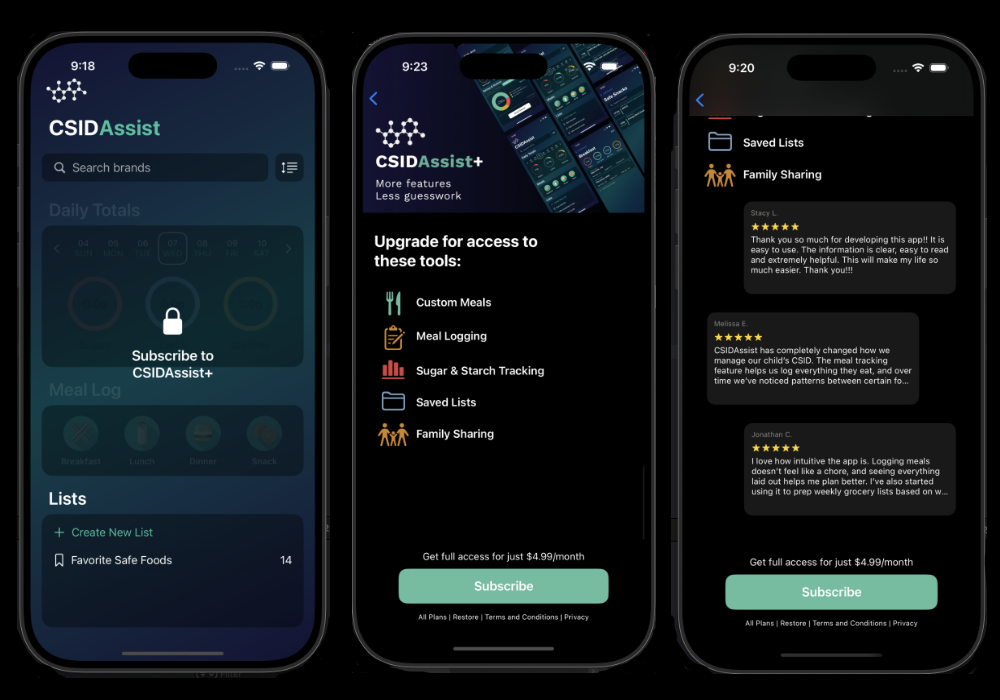

# 🔐 CSIDAssist_Paywall

> A focused iOS prototype showcasing a StoreKit 2-based paywall screen, designed to manage in-app purchases and subscriptions with modern SwiftUI patterns.

---

### Overview

**CSIDAssist_Paywall** is a minimal iOS application built to experiment with and demonstrate the integration of **StoreKit 2** for handling paywalls in SwiftUI apps. It is decoupled from the main CSIDAssist app and serves as a standalone module for exploring:

- Custom paywall UI design
- In-app purchases and subscriptions via StoreKit 2
- Handling product loading, purchases, and subscription status
- Paywall screen logic, including gated content and purchase flow
- SwiftUI architecture for modularity and preview support

---

### Features

- ✅ StoreKit 2 implementation using `Product`, `Transaction`, and `StoreKit.SubscriptionInfo`
- 🎨 Custom SwiftUI paywall interface with product tiers
- 🔒 Subscription gating for premium content
- 👁️ Real-time purchase state updates and error handling
- 🧪 Preview and test environments for easier development

---

### Technologies

- SwiftUI
- StoreKit 2 (iOS 15+)
- Swift Concurrency (`async/await`)

---

### Use Cases

This repo is intended as a learning resource or starting point for:

- Adding a subscription paywall to a SwiftUI app
- Understanding StoreKit 2 APIs and best practices
- Experimenting with different UI approaches for monetization screens
- Mocking paywall flows for UX validation or design iteration

---

### Screenshots



---

### Getting Started

1. Clone the repo  
   ```bash
   git clone https://github.com/vincemuller/CSIDAssist_Paywall.git
